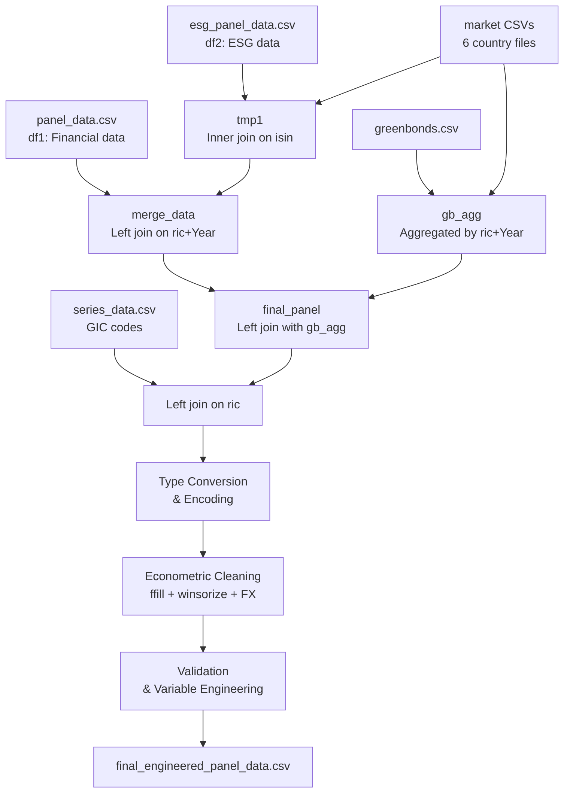

# Evaluation Report: [data-processing.ipynb](file:///Users/bunnypro/Projects/refinitiv-search/notebooks/data-processing.ipynb)

## Overview

This report evaluates the [data-processing.ipynb](file:///Users/bunnypro/Projects/refinitiv-search/notebooks/data-processing.ipynb) notebook used for the research project *"Impacts of Green Bond Issuance on Corporate Environmental and Financial Performance in ASEAN Listed Companies."*

The notebook contains **32 executed code cells** across 4 pipeline stages:
1. **Data Merging** (Cells 1–20): Loading & merging panel, ESG, market, green bond, and GIC data
2. **Data Processing** (Cells 21–29): Type conversion and dummy encoding
3. **Econometric Cleaning** (Cell 30): Missing values, winsorization, currency conversion, log transform
4. **Validation & Engineering** (Cells 31–32): Panel structure checks, descriptive stats, variable engineering

---

## Pipeline Flow Summary

---

## Step-by-Step Evaluation

### Stage 1: Data Merging (Cells 1–20)

#### ✅ Strengths
- Header-row cleanup (`df1[df1["Year"] != "Year"]`) correctly handles repeated CSV headers from appended writes in [data-preparation.py](file:///Users/bunnypro/Projects/refinitiv-search/data-preparation.py)
- Green bond `cumsum().clip(upper=1)` for `green_bond_active` is a clean way to create a persistent treatment dummy
- Aggregating green bond proceeds by [(ric, Year)](file:///Users/bunnypro/Projects/refinitiv-search/data-preparation.py#43-49) before merging avoids unwanted row multiplication

#### 🔴 Critical Issues

| # | Issue | Details | Impact |
|---|-------|---------|--------|
| 1 | **Many-to-many merge via market data** | ESG data (df2) is inner-joined with `market_data` on `isin`, but `market_data` can have multiple RICs per ISIN (see ZETRIX AI BHD with 4 duplicate rows for 2024). This inflates `tmp1`. | Duplicate rows enter `merge_data`, inflating the dataset from expected ~5k ESG obs to potentially more |
| 2 | **Deduplication masks the problem** | `drop_duplicates(subset=["ric", "Year"])` in Cell 10 silently picks the first row, discarding duplicates without investigating why they exist | Arbitrary data selection; some ESG values may be paired with wrong financial data |
| 3 | **Company name mismatch ignored** | df1 has `"3-2 INVESTMENT"` while df2 has `"3-2 INVESTMENT AND"` — the data was merged on `ric` (via ISIN→RIC mapping), so this works, but no validation confirms the match | Silent mismatches could exist for other companies |
| 4 | **Green bond PermID→RIC mapping multiplies** | One org_permid maps to multiple RICs (e.g., DBS with `DBSM.SI`, `DBSM.F`, `DBSDF.PK`, `DBSDY.PK`). All get green bond proceeds. | Non-ASEAN exchange RICs (`.F`, `.PK`) shouldn't be in the panel at all |
| 5 | **No ISIN for ~32% of observations** | `isin` has only 30,273 non-null out of 44,422 — these ~14k rows have no ESG data | Major gap in environmental variables coverage |

#### 🟡 Warnings

| # | Issue | Details |
|---|-------|---------|
| 6 | **[series_data.csv](file:///Users/bunnypro/Projects/refinitiv-search/data/series_data.csv) has duplicates** | Cell 19 shows shape jumping from 44,422 to 44,868 after merging GIC codes (446 new rows from duplicate tickers in series data) |
| 7 | **"Other" country** | Companies like HANWHA SOLUTIONS (009830.KS, South Korea) are labeled "Other". These are **not ASEAN** and should be filtered out or documented |
| 8 | **No year range validation** | Year 2025 data exists with almost all NaN financials — should be explicitly filtered |

---

### Stage 2: Data Processing (Cells 21–29)

#### 🔴 Critical Issues

| # | Issue | Details | Impact |
|---|-------|---------|--------|
| 9 | **All financial columns stored as `object` dtype** | The `info()` output shows 30 object columns. Many contain numeric strings that weren't converted until Cell 25 | Any operations before type conversion silently fail or produce wrong results |
| 10 | **`employees` included in `numeric_attributes`** | Employee count is converted to float, which is correct, but it has **only 6,643 non-null** out of 44,422 (85% missing) | Likely unusable as a variable |
| 11 | **`pd.get_dummies` on Y/N/NaN columns** | `environmental_investment` has values 'Y', 'N', NaN. Using `drop_first=True` drops `'N'`, so the dummy = True means 'Y'. But **NaN observations are coded as False**, which is the same as 'N'. | NaN (missing/not-reported) is treated identically to 'N' (explicitly no investment). This introduces **measurement error** |
| 12 | **`interest_expense_total` — 96.5% missing** | Only 1,540 non-null out of 44,422 | Column is essentially unusable |

#### 🟡 Warnings

| # | Issue | Details |
|---|-------|---------|
| 13 | **Missing `esg_score` column** | [data-preparation.py](file:///Users/bunnypro/Projects/refinitiv-search/data-preparation.py) defines `"Esg Score": "esg_score"` in `ESG_ATTRIBUTE_COLUMNS`, but the notebook's df2 only has 3 ESG columns (emissions_intensity, environmental_investment, internal_carbon_pricing). The `esg_score` and `estimated_total_carbon_footprint` are missing |
| 14 | **`gic` column is numeric** | GIC (Global Industry Classification) should be categorical, but it's treated as float and converted along with financial attributes |

---

### Stage 3: Econometric Cleaning (Cell 30)

#### ✅ Strengths
- Forward-fill grouped by `ric` is econometrically defensible for slowly-changing variables
- Currency conversion using `yfinance` yearly averages is a reasonable approach
- Log transform of `total_assets` is standard practice
- Winsorization at 1%/99% is appropriate for financial data

#### 🔴 Critical Issues

| # | Issue | Details | Impact |
|---|-------|---------|--------|
| 15 | **Massive data loss: 44,422 → 15,211 rows (66% drop)** | Dropping all rows where `total_assets` is NaN after ffill eliminates ~29k observations. Many firms apparently have no financial data at all | Sample may have severe **survivorship bias** — only well-reported firms survive |
| 16 | **Winsorization BEFORE currency conversion** | `ask_price`, `bid_price`, `total_assets`, `cash`, `net_sales_or_revenues` are winsorized in local currency, then divided by FX rates. Winsorization should happen AFTER conversion to a common currency | Vietnamese firms (with prices in thousands of VND) and Singapore firms (prices in single-digit SGD) are winsorized on the same scale in local currency — this is **statistically meaningless** |
| 17 | **`return_on_assets` and `return_on_equity_total` are currency-converted** | These are **ratios (percentages)** — they should NOT be divided by FX rates | ROA and ROE values are destroyed by this operation. A firm with ROA=10% in VND would become ROA ≈ 0.0004% after dividing by ~25,000 VND/USD |
| 18 | **FX fallback = 1.0 for "Other" country** | Companies tagged "Other" (like Korean firms) get no currency conversion, meaning their financial data remains in KRW | Mixed currency data in the final panel |
| 19 | **Forward-filling `environmental_investment`** | This is a boolean dummy (Y/N) — forward-filling it means if a firm reported 'Y' once, all subsequent NaN years become 'Y'. This may not reflect reality | Artificial inflation of environmental investment reporting |

#### 🟡 Warnings

| # | Issue | Details |
|---|-------|---------|
| 20 | **`warnings.filterwarnings('ignore')`** | Suppresses all warnings including potential data issues during winsorization and type conversion |
| 21 | **No outlier diagnostics** | No before/after comparison of winsorized values. No check for negative `total_assets` or other impossible values |
| 22 | **`return_on_assets` not winsorized properly** | After the erroneous FX conversion, ROA values are now near-zero. Winsorization on the pre-conversion values doesn't help |

---

### Stage 4: Validation & Engineering (Cells 31–32)

#### ✅ Strengths
- Panel structure diagnostics (1,481 firms, avg 10.27 years) are informative
- Descriptive statistics with skewness/kurtosis are good practice
- Correlation matrix looks reasonable (ROA↔ROE = 0.81 is expected)
- Lagged variables computed correctly via `groupby('ric').shift(1)`
- `Leverage = total_debt / total_assets` is a standard definition

#### 🔴 Critical Issues

| # | Issue | Details | Impact |
|---|-------|---------|--------|
| 23 | **Country/Year dummies created from already-corrupted data** | `pd.get_dummies(columns=['country', 'Year'], drop_first=True)` is applied, but the `country` column includes "Other" (non-ASEAN). Also Year=2025 has almost no data | Fixed effects include spurious categories |
| 24 | **Leverage max = 4.92** | Some firms have `total_debt > total_assets`, producing leverage > 1. Values approaching 5 suggest data errors or highly distressed firms | Should be investigated or capped |
| 25 | **`emissions_intensity` extreme skewness (33.5)** | Even after log transform to `ln_emissions_intensity`, the raw variable has maximum = 79.2M vs median = 539.5. These extreme outliers were NOT winsorized | Will dominate any regression using the raw variable |

#### 🟡 Warnings

| # | Issue | Details |
|---|-------|---------|
| 26 | **`Firm_Size` is just a copy of `ln_total_assets`** | Redundant column. `Firm_Size = final_panel['ln_total_assets']` creates a reference, not a copy. Modifying one affects the other |
| 27 | **Capital_Intensity max = 60.73** | CapEx/Total Assets > 1 is unusual. Values > 60 suggest data errors |
| 28 | **No VIF or multicollinearity check** | `total_assets` and `total_debt` have correlation of 0.99 — severe multicollinearity risk if both enter a regression |

---

## Summary Scorecard

| Dimension | Score | Notes |
|-----------|-------|-------|
| **Data Loading & Parsing** | ⭐⭐⭐☆☆ | Works but has duplicate/type issues from upstream |
| **Merging Logic** | ⭐⭐☆☆☆ | Many-to-many merge creates duplicates; mapping logic inflates data |
| **Data Type Handling** | ⭐⭐☆☆☆ | Columns remain as `object` too long; late conversion |
| **Missing Data Handling** | ⭐⭐☆☆☆ | 66% data loss; ffill on dummies is problematic |
| **Currency Conversion** | ⭐☆☆☆☆ | **Ratios (ROA, ROE) are erroneously converted**; winsorize happens before conversion |
| **Variable Engineering** | ⭐⭐⭐☆☆ | Correct formulas but applied on corrupted data |
| **Validation** | ⭐⭐⭐☆☆ | Good diagnostics but doesn't catch the issues above |
| **Code Quality** | ⭐⭐⭐☆☆ | Readable but uses `inplace=True`, suppresses warnings |

---

## Top 5 Action Items (Priority Order)

> [!CAUTION]
> Issues #16 and #17 (currency conversion of ratios + wrong winsorization order) **invalidate all regression results** downstream. These must be fixed before any analysis.

1. **Fix currency conversion**: Exclude ratio variables (`return_on_assets`, `return_on_equity_total`, `emissions_intensity`) from FX conversion. Move winsorization to AFTER currency conversion.

2. **Fix the `pd.get_dummies` encoding**: Replace `pd.get_dummies` with explicit binary mapping: `df['env_invest'] = df['environmental_investment'].map({'Y': 1, 'N': 0})` — keep NaN as NaN.

3. **Filter non-ASEAN firms and Year 2025**: Remove "Other" country firms (Korean, etc.) and Year=2025 rows before analysis.

4. **Investigate and fix duplicate creation**: Before `drop_duplicates`, audit how many duplicates exist and why. Consider deduplicating `market_data` to one RIC per ISIN before the ESG merge.

5. **Reduce data loss**: Instead of dropping all rows missing `total_assets`, consider: (a) keeping firms with at least 3 years of data, (b) imputing via interpolation within firm, (c) using the unbalanced panel methods.
