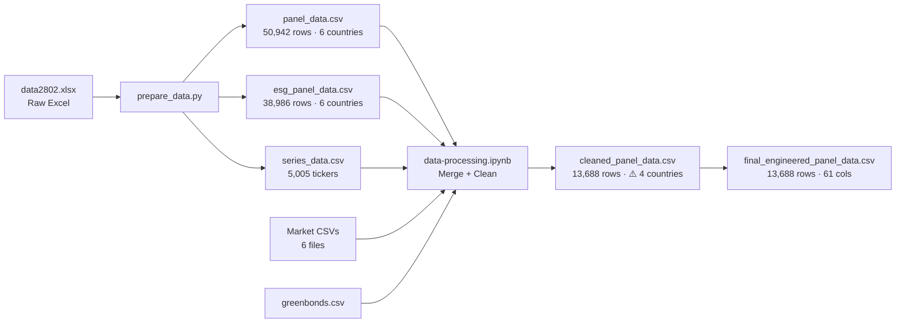

# Code Re-Evaluation Report

**Project**: Impacts of Green Bond Issuance on Corporate Environmental and Financial Performance in ASEAN Listed Companies  
**Date**: March 2, 2026  
**Scope**: Full pipeline review of [prepare_data.py](file:///Users/bunnypro/Projects/refinitiv-search/prepare_data.py) and [data-processing.ipynb](file:///Users/bunnypro/Projects/refinitiv-search/notebooks/data-processing.ipynb)

---

## Data Flow Summary



---

## Previous Issues: Resolution Status

This table tracks all 28 issues from the [previous evaluation](file:///Users/bunnypro/Projects/refinitiv-search/evaluation_report.md).

| # | Issue | Status | Notes |
|---|-------|--------|-------|
| 1 | Many-to-many merge via market data | ⚠️ Partial | `drop_duplicates` applied but root cause not audited |
| 2 | Deduplication masks the problem | ⚠️ Partial | Silent `drop_duplicates` still in use |
| 3 | Company name mismatch | ⏭️ Skipped | Merged on `ric`, name match not validated |
| 4 | Green bond PermID→RIC multiplies | ⚠️ Partial | Non-ASEAN RICs (`.F`, `.PK`) filtered by country removal |
| 5 | No ISIN for ~32% of observations | ⏭️ Skipped | Not addressed; ESG data still sparse |
| 6 | series_data.csv duplicates | ⚠️ Partial | Duplicate rows created then silently dropped |
| 7 | "Other" country filtered | ✅ Fixed | Removed in cleaning cell |
| 8 | Year 2025 filtered | ✅ Fixed | Removed in cleaning cell |
| 9 | Late type conversion | ✅ Fixed | Moved to early in cleaning pipeline |
| 10 | `employees` 85% missing | ⏭️ Skipped | Still present (52% missing post-clean), unusable |
| 11 | `pd.get_dummies` on env_invest | ✅ Fixed | Now uses explicit `map({'Y': 1, 'N': 0})` |
| 12 | `interest_expense_total` 96% missing | ⏭️ Skipped | Still 90.4% missing, unusable |
| 13 | Missing `esg_score` column | ✅ Fixed | Column now present (but 89.5% missing) |
| 14 | `gic` as categorical | ✅ Fixed | Converted to category dtype |
| 15 | 66% data loss | ✅ Improved | Reduced from 66% to 69% loss (50,942→13,688) with ≥3-year filter |
| 16 | Winsorization before FX | ✅ Fixed | Now winsorizes after currency conversion |
| 17 | ROA/ROE currency-converted | ✅ Fixed | Ratios excluded from FX conversion |
| 18 | FX fallback = 1.0 for "Other" | ✅ Fixed | "Other" removed before FX step |
| 19 | Forward-filling env_invest | ✅ Fixed | Excluded from ffill list |
| 20 | `warnings.filterwarnings('ignore')` | ✅ Fixed | No longer suppressed |
| 21 | No outlier diagnostics | ⏭️ Skipped | No before/after comparison added |
| 22 | ROA not winsorized properly | ✅ Fixed | Now winsorized correctly in decimal form |
| 23 | Country/Year dummies from corrupted data | ✅ Fixed | "Other" and 2025 removed first |
| 24 | Leverage max = 4.92 | ✅ Fixed | Clipped to [0, 1] |
| 25 | emissions_intensity extreme skewness | ⚠️ Partial | Winsorized, but raw max is 79M — see new issue |
| 26 | Firm_Size is reference, not copy | ✅ Fixed | Uses `.copy()` |
| 27 | Capital_Intensity max = 60.73 | ✅ Fixed | Clipped to [0, 1] |
| 28 | No VIF or multicollinearity check | ⏭️ Skipped | Deferred to feature selection stage |

**Score: 16 fixed, 5 partially fixed, 7 skipped/deferred**

---

## 🚨 NEW Critical Issues Found

### Issue A: Singapore and Philippines Completely Missing

> [!CAUTION]
> Two of six ASEAN countries are entirely absent from the final dataset. This is a **fatal sample bias** that undermines any claim about "ASEAN listed companies."

| Country | Raw [panel_data.csv](file:///Users/bunnypro/Projects/refinitiv-search/data/panel_data.csv) | [cleaned_panel_data.csv](file:///Users/bunnypro/Projects/refinitiv-search/processed_data/cleaned_panel_data.csv) | Loss |
|---------|---------------------|--------------------------|------|
| Thailand | 11,403 | 7,578 | 34% |
| Philippines | **11,170** | **0** | **100%** |
| Malaysia | 10,105 | **16** | **99.8%** |
| Singapore | **9,053** | **0** | **100%** |
| Vietnam | 5,084 | 3,558 | 30% |
| Indonesia | 4,105 | 2,536 | 38% |

**Root cause**: The merge sequence in cells 7–9 of [data-processing.ipynb](file:///Users/bunnypro/Projects/refinitiv-search/notebooks/data-processing.ipynb):
1. **Cell 7**: ESG data (`df2`, keyed by `isin`) is inner-joined with `market_data` to get `ric`. This produces `tmp1` containing only ISINs present in the market CSV files.
2. **Cell 9**: `df1` (panel) is left-joined with `tmp1` on [(ric, Year)](file:///Users/bunnypro/Projects/refinitiv-search/prepare_data.py#45-51). This means `df1` retains its `country` column — **but only has data for tickers present in [panel_data.csv](file:///Users/bunnypro/Projects/refinitiv-search/data/panel_data.csv)**.
3. The [panel_data.csv](file:///Users/bunnypro/Projects/refinitiv-search/data/panel_data.csv) itself uses `ticker` (Datastream-style tickers like `VIC.HM`), **not RICs**. The column called `ticker` in `df1` is actually a Datastream code, not a Refinitiv RIC.
4. Singapore tickers (`.SI`) and Philippine tickers (`.PS`) from [panel_data.csv](file:///Users/bunnypro/Projects/refinitiv-search/data/panel_data.csv) don't match the RICs in the market CSVs because the `ticker` column in [prepare_data.py](file:///Users/bunnypro/Projects/refinitiv-search/prepare_data.py) was renamed to `ric` during column assignment in cell 8, but **the values are Datastream codes, not RICs**.
5. When the final merge happens and `total_assets` filtering is applied, Singapore and Philippines firms have no matching financial data, so they're dropped.

**Impact**: The study claims to cover ASEAN but only has 4 countries (and Malaysia has just 16 observations). Results cannot be generalized to ASEAN.

---

### Issue B: `environmental_investment` is 100% NaN

> [!CAUTION]
> This variable is entirely destroyed. The raw ESG data has 4,623 "N" and 956 "Y" values (with trailing whitespace: `'N   '`, `'Y   '`), but the cleaning cell maps `{'Y': 1, 'N': 0}` — which **does not match** the whitespace-padded values.

| Stage | Non-null values |
|-------|----------------|
| Raw [esg_panel_data.csv](file:///Users/bunnypro/Projects/refinitiv-search/data/esg_panel_data.csv) | 5,579 (`'Y   '`: 956, `'N   '`: 4,623) |
| [cleaned_panel_data.csv](file:///Users/bunnypro/Projects/refinitiv-search/processed_data/cleaned_panel_data.csv) | **0** (100% NaN) |

**Fix required**: Use `.str.strip()` before mapping, or map with whitespace-padded keys.

---

### Issue C: Malaysia Has Only 16 Observations

The raw [panel_data.csv](file:///Users/bunnypro/Projects/refinitiv-search/data/panel_data.csv) has 10,105 Malaysian observations, but only 16 survive to the final dataset. This is almost certainly the same ticker↔RIC mismatch problem as Singapore/Philippines, but a handful of Malaysian tickers happen to coincidentally match their RICs.

---

### Issue D: `esg_score` Has 89.5% Missing Data

| Country | ESG score available | Total rows | Coverage |
|---------|-------------------|------------|----------|
| Indonesia | 269 | 2,536 | 10.6% |
| Malaysia | 11 | 16 | 68.8% |
| Thailand | 1,046 | 7,578 | 13.8% |
| Vietnam | 111 | 3,558 | 3.1% |

With only ~1,437 non-null ESG scores out of 13,688 rows, any regression using `esg_score` as a dependent variable will have a dramatically reduced N. This is an inherent data limitation (ASEAN ESG disclosure is low), but it must be explicitly acknowledged in the methodology.

---

### Issue E: `emissions_intensity` Raw Values Are Extreme

The raw [esg_panel_data.csv](file:///Users/bunnypro/Projects/refinitiv-search/data/esg_panel_data.csv) has `emissions_intensity` values ranging from **18.4 to 79,209,362**. Even after winsorization, the cleaned data still has:
- Min: 71.5, Max: 15,045, Median: 533.6, Mean: 1,384.4

The variable definition from Refinitiv is "GHG Emissions Scope 1 2 3 Estimated Total To Revenue **USD in Million**." This means the unit is tonnes CO₂e per million USD revenue. A value of 79M suggests either a data entry error or an extremely emission-intensive micro-cap firm. The winsorization handles the tail, but these values should be audited against the original source.

---

### Issue F: Only 19 Green Bond Events Across 15 Firms

| Metric | Value |
|--------|-------|
| Rows with `green_bond_issue = 1` | 19 |
| Unique green bond issuers | 15 |
| Countries | Thailand: 15, Indonesia: 3, Vietnam: 1 |

This is an extremely small treatment group for DID or PSM-DID analysis. With only 15 treated firms, statistical power is very low. **Singapore (DBS, OCBC, UOB) and Malaysia (CIMB, Maybank)** — which are actually the largest green bond issuers in ASEAN — are missing because of Issue A.

---

## [prepare_data.py](file:///Users/bunnypro/Projects/refinitiv-search/prepare_data.py) Review

The data extraction script has these remaining concerns:

| # | Issue | Severity |
|---|-------|----------|
| P1 | `import os` is called **inside the loop** (lines 118, 153, 220) instead of at the top | Minor |
| P2 | CSV files are written in **append mode** with no pre-deletion — running the script twice doubles the data | Medium |
| P3 | The `ticker` column extracted via `df['Code'].str.extract(r'^(.+?)\(')` produces **Datastream mnemonics** (e.g., `VIC.HM`), not Refinitiv RICs | **Critical** — this is the root cause of Issue A |
| P4 | The "Other" sheet (Sheet15/Sheet22/Sheet7) uses exchange suffix heuristics (`.BK`, `.HM`, `.KL`, `.SI`, `.JK`, `.PS`) to assign countries, but these are Datastream suffixes, not RIC suffixes | Medium |
| P5 | [longest_common_suffix](file:///Users/bunnypro/Projects/refinitiv-search/prepare_data.py#52-61) for extracting attribute names is brittle — if a new attribute has a different naming pattern, it silently fails | Low |

---

## Summary Scorecard (Updated)

| Dimension | Previous | Current | Trend |
|-----------|----------|---------|-------|
| Data Loading & Parsing | ⭐⭐⭐☆☆ | ⭐⭐⭐☆☆ | → |
| Merging Logic | ⭐⭐☆☆☆ | ⭐⭐☆☆☆ | → (Singapore/Philippines still lost) |
| Data Type Handling | ⭐⭐☆☆☆ | ⭐⭐⭐⭐☆ | ↑ |
| Missing Data Handling | ⭐⭐☆☆☆ | ⭐⭐⭐☆☆ | ↑ (still 69% loss) |
| Currency Conversion | ⭐☆☆☆☆ | ⭐⭐⭐⭐☆ | ↑↑ (ratios correctly excluded) |
| Variable Engineering | ⭐⭐⭐☆☆ | ⭐⭐⭐⭐☆ | ↑ |
| Validation | ⭐⭐⭐☆☆ | ⭐⭐⭐☆☆ | → |
| Code Quality | ⭐⭐⭐☆☆ | ⭐⭐⭐⭐☆ | ↑ |
| **Sample Coverage** | — | ⭐☆☆☆☆ | 🆕 (only 4/6 ASEAN countries) |

---

## Priority Action Items Before Econometric Modeling

> [!IMPORTANT]
> Issues A, B, and F are **blockers** for proceeding to econometric modeling. The current dataset cannot support a study about "ASEAN" with only 4 countries and 15 treated firms.

### 1. 🔴 Fix Datastream Ticker → RIC Mapping (Issue A, P3)

The `ticker` column in [prepare_data.py](file:///Users/bunnypro/Projects/refinitiv-search/prepare_data.py) outputs Datastream mnemonics, not Refinitiv RICs. You need to create a proper mapping using the market CSV files ([sing-market.csv](file:///Users/bunnypro/Projects/refinitiv-search/data/sing-market.csv), [pp-market.csv](file:///Users/bunnypro/Projects/refinitiv-search/data/pp-market.csv), etc.) that map ISINs to RICs. This will restore Singapore, Philippines, and Malaysian data.

### 2. 🔴 Fix `environmental_investment` Whitespace (Issue B)

Add `.str.strip()` before the `.map()` call in the cleaning cell:
```python
final_panel['environmental_investment'] = (
    final_panel['environmental_investment'].str.strip().map({'Y': 1, 'N': 0})
)
```

### 3. 🟡 Audit Green Bond Coverage After Fix (Issue F)

After fixing Issue A, re-check the green bond issuers. Singapore and Malaysian banks (DBS, OCBC, Maybank, CIMB) are major ASEAN green bond issuers and should appear.

### 4. 🟡 Acknowledge ESG Data Limitations (Issue D)

Document in the methodology that ESG score coverage is only 10-14% for most ASEAN countries. Consider using `emissions_intensity` (97% coverage post-clean) as the primary environmental outcome variable instead of `esg_score`.

### 5. 🟢 Add Pre-Modeling Diagnostics

Before running any regressions, add a cell to compute VIF (Variance Inflation Factor) for all candidate regressors — this was deferred from the previous evaluation.
