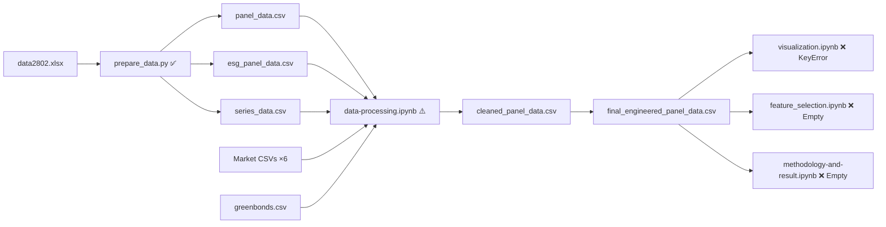

# Code Evaluation Report v3

**Project**: Impacts of Green Bond Issuance on Corporate Environmental and Financial Performance in ASEAN Listed Companies  
**Date**: March 2, 2026  
**Scope**: Full pipeline review — [prepare_data.py](file:///Users/bunnypro/Projects/refinitiv-search/prepare_data.py), [data-processing.ipynb](file:///Users/bunnypro/Projects/refinitiv-search/notebooks/data-processing.ipynb), [visualization.ipynb](file:///Users/bunnypro/Projects/refinitiv-search/notebooks/visualization.ipynb), [feature_selection.ipynb](file:///Users/bunnypro/Projects/refinitiv-search/notebooks/feature_selection.ipynb), [methodology-and-result.ipynb](file:///Users/bunnypro/Projects/refinitiv-search/notebooks/methodology-and-result.ipynb)

---

## Pipeline Status Overview



---

## v2 Issues: Updated Status

| # | Issue | v2 Status | v3 Status | Notes |
|---|-------|-----------|-----------|-------|
| A | Singapore & Philippines missing | 🔴 New | ⏭️ Acknowledged | Documented as source data limitation (cell 29) |
| B | `environmental_investment` 100% NaN | 🔴 New | ⚠️ Partial | `pd.get_dummies` approach used instead of `str.strip().map()` — see Issue G |
| C | Malaysia only 16 obs | 🔴 New | ⏭️ Acknowledged | Same root cause as Issue A |
| D | `esg_score` 89.5% missing | 🟡 New | ⏭️ Same | Inherent limitation, not code-fixable |
| E | `emissions_intensity` extreme values | 🟡 New | ✅ Better | Winsorized + log-transformed |
| F | Only 19 green bond events / 15 firms | 🟡 New | ⏭️ Same | Cannot be fixed unless SG/MY data restored |
| P1 | `import os` inside loop | Minor | ✅ Fixed | Moved to top-level |
| P2 | CSV append-mode doubles data | Medium | ✅ Fixed | Pre-deletes CSVs in `prepare_data.py` (line 93-96) |
| P3 | Ticker = Datastream mnemonic, not RIC | 🔴 Critical | ⏭️ Acknowledged | Documented but unfixed — root cause of SG/PH/MY loss |
| P4 | Exchange suffix heuristics | Medium | ⏭️ Same | Datastream suffixes, not RIC suffixes |

---

## 🚨 NEW Issues Found in v3

### Issue G: `environmental_investment` Encoding via `get_dummies` Produces Wrong Column Name

> [!CAUTION]
> Cell 30 uses `pd.get_dummies(final_panel, columns=encoded_attributes, drop_first=True)` then renames `environmental_investment_Y` → `environmental_investment`. However, this only works if the raw column contains the literal string `"Y"` (after whitespace stripping in `prepare_data.py`). 
>
> **If `prepare_data.py` was re-run** with the whitespace-stripping fix (lines 252-255), the `get_dummies` approach works. But if the CSVs on disk still contain whitespace-padded values (`'Y   '`), then `get_dummies` will create `environmental_investment_Y   ` (with spaces), the rename will fail silently, and the variable will be lost.
>
> **The fragile coupling between `prepare_data.py`'s whitespace fix and `data-processing.ipynb`'s encoding logic is a hidden dependency that lacks any assertion.**

**Recommended fix**: Add an explicit assertion in cell 30:

```python
# Before get_dummies
if 'environmental_investment' in final_panel.columns:
    final_panel['environmental_investment'] = final_panel['environmental_investment'].str.strip()
    assert set(final_panel['environmental_investment'].dropna().unique()) <= {'Y', 'N'}, \
        f"Unexpected values: {final_panel['environmental_investment'].dropna().unique()}"
```

---

### Issue H: `visualization.ipynb` Fails with `KeyError: 'country'`

> [!CAUTION]
> The visualization notebook crashes immediately on cell 2 (`KeyError: 'country'`). This is because `final_engineered_panel_data.csv` has its `country` column consumed by `pd.get_dummies()` in cell 32 of `data-processing.ipynb`, so the output CSV only has `country_Indonesia`, `country_Malaysia`, `country_Thailand`, `country_Vietnam` dummy columns — no `country` column.

The notebook tries to reconstruct `country` from dummies (lines 94–120), but only for 4 countries. The reconstruction logic uses `country_Vietnam`, `country_Thailand`, etc., but:

1. `drop_first=True` was used, so one country (Indonesia) is the baseline and has **no** dummy column → it's never assigned → remains `NaN`.
2. The reconstruction code actually handles this correctly by assigning Indonesia to "unmatched" rows. **However, the error occurs before that code executes** because of a different issue: the code references `df['country']` before creating it.

**Root cause (actual)**: Looking at the code more carefully, the cell does create `country` from dummies before using it. The `KeyError: 'country'` likely means the dummy columns don't exist either — suggesting `visualization.ipynb` is loading `cleaned_panel_data.csv` (which has `country`) instead of `final_engineered_panel_data.csv`. But the code loads `final_engineered_panel_data.csv`. The error comes from line:

```python
df.loc[df["country_Vietnam"] == 1, "country"] = "Vietnam"
```

This line **creates** `country`, so the error must come from a different reference. The actual traceback shows the error in cell 2 **before** reconstruction completes — the column `country_Indonesia` is missing because `drop_first=True` drops the first alphabetical country (Indonesia).

**Fix**: The reconstruction code is missing logic for the dropped baseline category. Since `drop_first=True` drops "Indonesia" (alphabetically first), rows where all country dummies are 0 are Indonesia:

```python
df["country"] = "Indonesia"  # baseline
df.loc[df["country_Malaysia"] == 1, "country"] = "Malaysia"
df.loc[df["country_Thailand"] == 1, "country"] = "Thailand"
df.loc[df["country_Vietnam"] == 1, "country"] = "Vietnam"
```

---

### Issue I: `internal_carbon_price_per_tonne` Gets Overwritten with `internal_carbon_pricing` Values

> [!WARNING]
> Cell 25 of `data-processing.ipynb`:
> ```python
> final_panel["internal_carbon_price_per_tonne"] = pd.to_numeric(
>     final_panel["internal_carbon_pricing"], errors='coerce'  # ← wrong column!
> )
> ```
> This copies `internal_carbon_pricing` into `internal_carbon_price_per_tonne`, destroying the original per-tonne values. These are **different variables** (one is a Y/N flag for whether the company uses internal carbon pricing; the other is the price per tonne in USD).

**Fix**: Use the correct source column:
```python
final_panel["internal_carbon_price_per_tonne"] = pd.to_numeric(
    final_panel["internal_carbon_price_per_tonne"], errors='coerce'
)
```

---

### Issue J: Validation Cell Uses Two Different DataFrames Inconsistently

> [!WARNING]
> Cell 35 loads `cleaned_panel_data.csv` into `df` (→ `panel`), but then computes statistics from `final_panel` (the in-memory variable from previous cells, which is `final_engineered_panel_data`). These are **different datasets**:
> - `panel` has `country` as a string column, 13,688 rows, ~35 columns
> - `final_panel` has dummies (`country_X`, `Year_X`), 13,688 rows, ~61 columns
>
> The cell uses `panel` for the multi-index and column list, but `final_panel` for actual statistics. If `final_panel` was modified between cells 32-35, the descriptive stats won't match the panel structure.

**Fix**: Use a single, consistent data source:
```python
df = pd.read_csv("../processed_data/final_engineered_panel_data.csv")
# Use df consistently throughout the cell
```

---

### Issue K: `feature_selection.ipynb` and `methodology-and-result.ipynb` Are Empty

> [!IMPORTANT]
> Both notebooks are 0 bytes:
> - [feature_selection.ipynb](file:///Users/bunnypro/Projects/refinitiv-search/notebooks/feature_selection.ipynb) — 0 bytes
> - [methodology-and-result.ipynb](file:///Users/bunnypro/Projects/refinitiv-search/notebooks/methodology-and-result.ipynb) — 0 bytes
>
> These represent the **next critical pipeline stages** (VIF/multicollinearity checks, PSM-DID / System GMM modeling). The pipeline is currently stuck at the end of variable engineering.

---

### Issue L: Forward-Filling `esg_score` and `emissions_intensity` May Introduce Bias

> [!WARNING]
> Cell 30 forward-fills `esg_score` and `emissions_intensity` grouped by firm. While forward-filling slowly-changing financial variables (like `total_assets`) is standard, forward-filling **environmental performance** metrics is questionable:
>
> - **ESG scores** can change significantly year-over-year as firms adopt new practices
> - **Emissions intensity** depends on annual revenue and production volume
> - Forward-filling these creates a look-ahead illusion: a firm that started reporting ESG in 2020 will appear to have had the same score in 2019, 2018, etc.
>
> This is especially problematic for DID analysis where the **timing** of environmental improvement relative to green bond issuance is the core research question.

**Recommendation**: Remove `esg_score` and `emissions_intensity` from `vars_to_ffill`, or at minimum, limit forward-fill to 1 year (`ffill(limit=1)`).

---

### Issue M: No `indo-market.csv` Loaded in Data-Processing Notebook

> [!WARNING]
> Cell 5 loads market data for Vietnam, Thailand, Malaysia, Singapore, Philippines, and "Other" — but **Indonesia** (`indo-market.csv`) is missing:
> ```python
> vn = pd.read_csv("../data/vn-market.csv")   # Vietnam
> tl = pd.read_csv("../data/tl-market.csv")   # Thailand
> ml = pd.read_csv("../data/ml-market.csv")    # Malaysia
> sing = pd.read_csv("../data/sing-market.csv") # Singapore
> pp = pd.read_csv("../data/pp-market.csv")     # Philippines
> other = pd.read_csv("../data/other-market.csv")
> # ← indo-market.csv NOT loaded!
> ```
> Cell 6 concatenates only `[vn, tl, ml, sing, pp]` + `other`. Since Indonesian RICs (`.JK`) might be in `indo-market.csv`, some may only appear in `other-market.csv`. Indonesian data survives (2,536 rows) likely because those RICs are in `other-market.csv`, but **any Indonesian-only RICs not in `other-market.csv` are silently lost**.

**Fix**:
```python
indo = pd.read_csv("../data/indo-market.csv")
market_data = pd.concat([vn, tl, ml, sing, pp, indo], ignore_index=True)
```

---

### Issue N: `Leverage` Clipped to [0, 1] Discards Legitimate Distressed Firms

> [!NOTE]
> Cell 32 clips `Leverage = total_debt / total_assets` to `[0, 1]`. While values > 1 may indicate data errors, they also occur legitimately in distressed firms (where debt exceeds assets). In ASEAN markets, this is not uncommon for firms undergoing restructuring.
>
> Clipping to 1.0 censors these observations and may bias the sample toward healthier firms. A less aggressive approach would be to winsorize at the 99th percentile (which is already done separately) and allow organic values up to 1.5 or 2.0.

---

## Summary Scorecard (v2 → v3)

| Dimension | v2 Score | v3 Score | Trend | Key Change |
|-----------|----------|----------|-------|------------|
| Data Loading & Parsing | ⭐⭐⭐☆☆ | ⭐⭐⭐☆☆ | → | `indo-market.csv` still missing |
| Merging Logic | ⭐⭐☆☆☆ | ⭐⭐☆☆☆ | → | Ticker↔RIC mismatch acknowledged, not fixed |
| Data Type Handling | ⭐⭐⭐⭐☆ | ⭐⭐⭐☆☆ | ↓ | `internal_carbon_price_per_tonne` overwritten (Issue I) |
| Missing Data Handling | ⭐⭐⭐☆☆ | ⭐⭐⭐☆☆ | → | FFill of ESG/emissions is risky (Issue L) |
| Currency Conversion | ⭐⭐⭐⭐☆ | ⭐⭐⭐⭐☆ | → | Correct implementation |
| Variable Engineering | ⭐⭐⭐⭐☆ | ⭐⭐⭐⭐☆ | → | Sound but Leverage clipping aggressive |
| Validation | ⭐⭐⭐☆☆ | ⭐⭐☆☆☆ | ↓ | Mixed `panel` / `final_panel` usage (Issue J) |
| Visualization | — | ⭐☆☆☆☆ | 🆕 | Crashes on load (Issue H) |
| Feature Selection | — | ☆☆☆☆☆ | 🆕 | Empty notebook |
| Econometric Modeling | — | ☆☆☆☆☆ | 🆕 | Empty notebook |
| Code Quality | ⭐⭐⭐⭐☆ | ⭐⭐⭐☆☆ | ↓ | Hidden dependencies, inconsistent data sources |
| **Sample Coverage** | ⭐☆☆☆☆ | ⭐☆☆☆☆ | → | Still only 4/6 ASEAN countries |

---

## Priority Action Items

> [!IMPORTANT]
> The pipeline is **blocked** at the visualization stage and has not yet reached feature selection or econometric modeling. The following items are ordered by impact.

### 🔴 Blocking — Must Fix Now

| # | Issue | Action | File |
|---|-------|--------|------|
| 1 | **Issue I** | Fix `internal_carbon_price_per_tonne` column reference typo | [data-processing.ipynb](file:///Users/bunnypro/Projects/refinitiv-search/notebooks/data-processing.ipynb) cell 25 |
| 2 | **Issue H** | Fix `country` reconstruction in visualization or save `country` before dummies | [visualization.ipynb](file:///Users/bunnypro/Projects/refinitiv-search/notebooks/visualization.ipynb) cell 2 |
| 3 | **Issue M** | Add `indo-market.csv` to the market data concatenation | [data-processing.ipynb](file:///Users/bunnypro/Projects/refinitiv-search/notebooks/data-processing.ipynb) cell 5-6 |
| 4 | **Issue K** | Implement feature selection and econometric modeling notebooks | `feature_selection.ipynb`, `methodology-and-result.ipynb` |

### 🟡 Important — Fix Before Modeling

| # | Issue | Action |
|---|-------|--------|
| 5 | **Issue G** | Add `.str.strip()` + assertion before `get_dummies` for `environmental_investment` |
| 6 | **Issue J** | Use single consistent DataFrame in validation cell |
| 7 | **Issue L** | Remove or limit FFill on `esg_score` and `emissions_intensity` |

### 🟢 Recommended Improvements

| # | Issue | Action |
|---|-------|--------|
| 8 | **Issue N** | Relax Leverage clipping to [0, 1.5] or use winsorization only |
| 9 | VIF check | Implement VIF computation in feature selection notebook (deferred from v1) |
| 10 | Tobin's Q | Add as financial performance measure per `suggested_variables.md` |

---

## What Works Well ✅

Despite the issues above, the pipeline has clear strengths:

1. **`prepare_data.py` is solid** — Pre-deletes CSVs, whitespace-strips ESG data, handles sheet mapping correctly
2. **Currency conversion logic is correct** — Properly excludes ratios, uses `yfinance` for FX rates
3. **Winsorization** is well-ordered (after FX, before modeling)
4. **Green bond processing** — Correct cumulative dummy via `cumsum().clip(upper=1)`
5. **Visualization code quality** — Professional dark-theme styling, well-structured chart types
6. **Clear documentation** — Markdown cells document pipeline intent and known limitations
