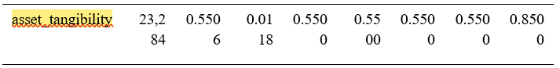
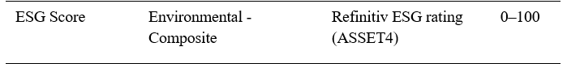
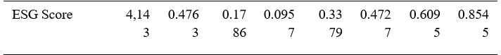
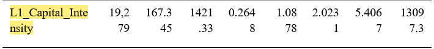
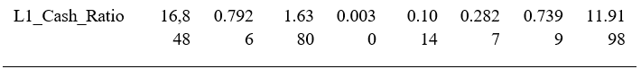
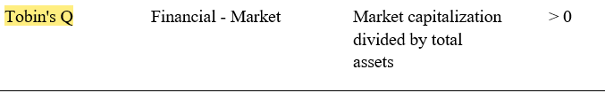
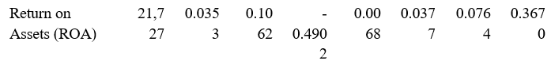
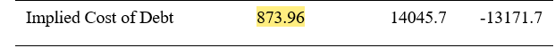

4.6.6 bị bỏ sót không đánh số — bài nhảy thẳng từ 4.6.5 sang 4.6.7

Tiêu đề "3.4. Descriptive Statistics" bị lặp.

2 tab Outline và Outline_2 đều có Chương III & IV, thế đâu mới là bản chính thức?

Biến asset_tangibility (Table 3.4) có các phân vị thứ 25, 50, 75 đều bằng 0.55 với độ lệch chuẩn chỉ 0.0118.

Tức là dữ liệu thực tế phần lớn là như nhau đối với biến này

Đây là sai sót về input hay đây là giá trị mặc định hay như thế nào?

Không thấy cơ sở lý luận của “Table 4.11 Green Bond Authenticity Score”. Trọng số ko được jusified. Đây là khoảng trống về phương pháp.

Scale của biến ESG Score là 0-100 (Table 3.2)

Nhưng mean = 0.4763, max = 0.8545 (Table 3.4) -> Scale là 0-1

Rốt cục scale là 0-1 hay 0-100 ?

Biến L1_Capital_Intensity  = Capital expenditures divided by total assets at t – 1

Về mặt logic thì biến này nằm trong khoảng 0-1ran. Sao số nó to thế này. Nhất là giá trị max tận 13 nghìn

Biến L1_Cash_Ratio cùng vậy, sao có giá trị max to thế nhỉ. Tức là tiền mặt gấp 11 lần total asset ?

Xem lại biến tobin’s Q. Cách đo trong ảnh là tính price to book Assets ratio

ROA scale là 0-1

Nhưng có giá trị âm ở giá trị min. Scale 0-1 thì sao có giá trị âm đc

Cost of debt cũng có những giá trị quá lớn. 873.96 tức là 87396% à?

Không thấy hypothesis gì ở chapter 2. Ko đưa ra H1, H2 à…

Viona et al. (2026) là đã được peer review chưa ? Nếu chưa đc review thì ko đáng tin cậy. Mình trích dẫn nhiều nguồn kiểu vậy thì bài mình cũng ko vững

Bỏ Acknowledgements đi nhé các em

Tên đề tài ở Preface và chapter 1 khác nhau.